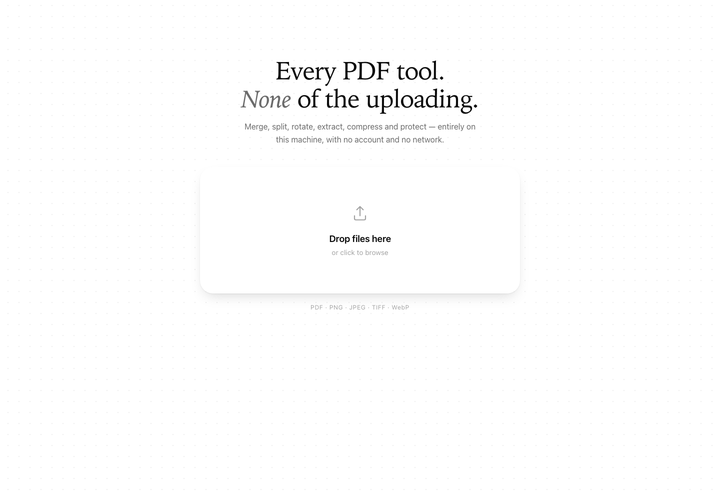
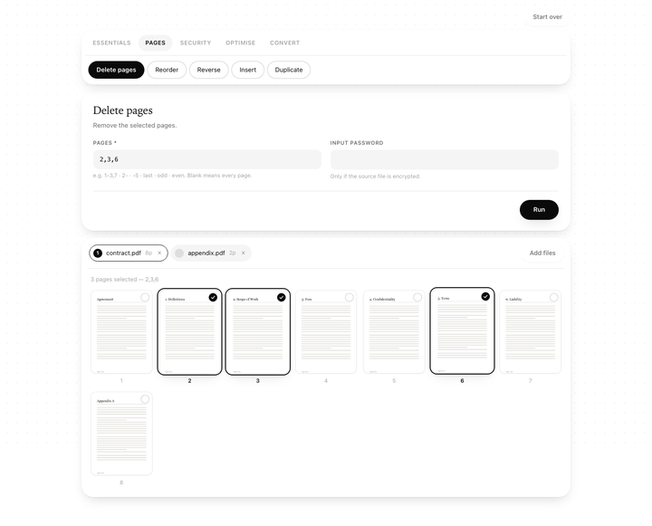
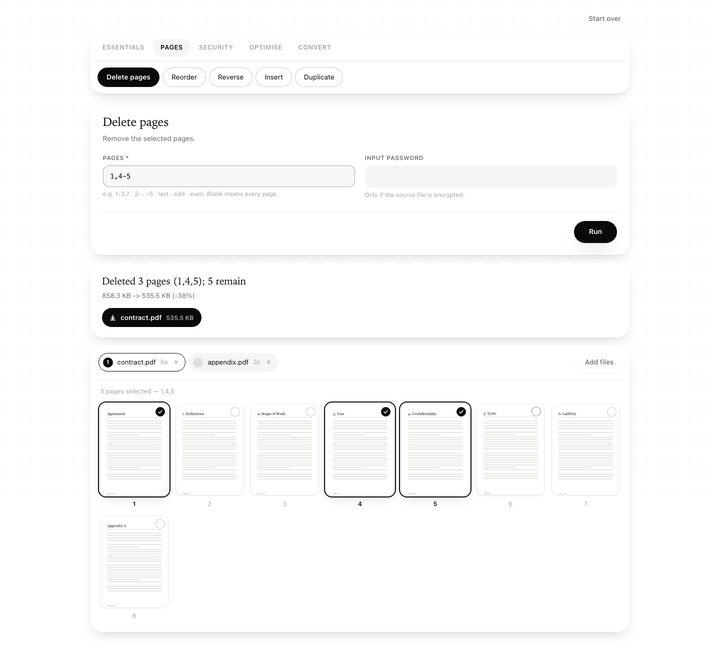

# Recto

**A local-first PDF toolkit.** Merge, split, rotate, extract, compress, encrypt
and convert PDFs — entirely on your own machine.

[](https://github.com/amndrd/recto/actions/workflows/ci.yml)
[](https://www.python.org/downloads/)
[](LICENSE)

Every free PDF tool on the web asks you to upload the document first. That is
fine for a holiday itinerary and a bad idea for a contract, a payslip, a
medical record or an ID scan. Recto does the same jobs with no upload, no
account and no network access at all.

<p align="center">
  
</p>

Use it whichever way suits you:

- **A window in your browser** — drop a file in, click the pages you want, download the result.
- **A command line** — seventeen commands, scriptable, with proper exit codes.
- **A Python library** — the same operations as plain functions.

---

## Contents

- [**Getting started**](#getting-started) ← start here
- [The web interface](#the-web-interface)
- [Command reference](#command-reference)
- [Page ranges](#page-ranges)
- [Recipes](docs/recipes.md)
- [As a Python library](#as-a-python-library)
- [Privacy and safety](#privacy-and-safety)
- [How it works](#how-it-works)
- [Contributing](#contributing)

---

# Getting started

Four steps. It takes about two minutes, and you only do it once.

Everything below is typed into a **terminal**:

- **macOS** — press `⌘ + Space`, type `Terminal`, press Enter.
- **Windows** — press the Windows key, type `PowerShell`, press Enter.
- **Linux** — you know where it is.

Lines starting with `$` are what you type; the `$` itself is not part of the
command.

---

## Step 1 — Check that you have Python

Recto needs **Python 3.10 or newer**. Most Macs and Linux machines already have
it. Check:

```console
$ python3 --version
Python 3.12.4
```

On **Windows**, use `python` instead of `python3`:

```console
> python --version
Python 3.12.4
```

**If you see 3.10 or higher**, skip to Step 2.

**If you see 3.9 or lower, or `command not found`**, install Python:

| Your system | What to do |
| --- | --- |
| macOS | Download from [python.org/downloads](https://www.python.org/downloads/), or `brew install python` if you use [Homebrew](https://brew.sh) |
| Windows | Download from [python.org/downloads](https://www.python.org/downloads/) — **tick "Add python.exe to PATH"** during setup |
| Debian / Ubuntu | `sudo apt install python3 python3-pip python3-venv` |
| Fedora | `sudo dnf install python3 python3-pip` |

Then close the terminal, open a new one, and check the version again.

---

## Step 2 — Install Recto

Recto is not on PyPI yet, so it installs straight from this repository. That
needs [git](https://git-scm.com/downloads) as well as Python.

### The recommended way: pipx

[pipx](https://pipx.pypa.io/) installs command-line tools into their own
isolated environment, so Recto can never clash with anything else on your
machine. Install pipx first:

```console
$ python3 -m pip install --user pipx
$ python3 -m pipx ensurepath
```

**Close your terminal and open a new one.** That last command changed your
`PATH`, and the change only applies to terminals opened afterwards.

Now install Recto:

```console
$ pipx install "recto[all] @ git+https://github.com/amndrd/recto"
```

### The simpler way: pip

If you would rather not install pipx:

```console
$ python3 -m pip install --user "recto[all] @ git+https://github.com/amndrd/recto"
```

<details>
<summary><b>What does <code>[all]</code> mean?</b></summary>

Recto's base install is deliberately small, and the heavier libraries sit
behind optional *extras*. `[all]` gets everything, which is what you want
unless you are tight on disk space.

| Extra | Adds | Needed for |
| --- | --- | --- |
| *(base)* | `pypdf` | merge, split, rotate, extract, page edits, encryption, metadata |
| `optimize` | `pikepdf` (qpdf) | `compress`, `repair` |
| `images` | `pypdfium2`, `Pillow` | `to-images`, `from-images`, page previews in the browser |
| `web` | `fastapi`, `uvicorn` | the browser interface |
| `all` | all of the above | everything |

Install just what you need with, for example,
`pipx install "recto[optimize] @ git+https://github.com/amndrd/recto"`.
If you later ask for a feature whose extra is missing, Recto tells you exactly
what to install rather than failing with a confusing import error.
</details>

### Check that it worked

```console
$ recto --version
recto 0.1.0
```

If that prints a version, you are done installing. If it says
`command not found`, see [If something goes wrong](#if-something-goes-wrong).

---

## Step 3 — Open Recto

```console
$ recto serve
```

Your browser opens at **`http://localhost:8765`** with Recto in it.

That is all "opening Recto" means: a small program running on your own
computer, which you happen to look at through a browser. Nothing is on the
internet, and the address is not reachable by anyone else.

To stop it, go back to the terminal and press **`Ctrl + C`**.

> Leave that terminal window open while you use Recto — closing it stops the
> program. To open Recto again later, run `recto serve` again.

---

## Step 4 — Your first job

<p align="center">
  
</p>

1. **Drop a PDF** onto the card in the middle of the screen — or click the card
   to browse for one.
2. The page turns into your document: every page as a thumbnail, with the tools
   above it in five tabs.
3. **Pick a tool.** Say you want to remove some pages: open the **Pages** tab
   and click **Delete pages**.
4. **Click the pages you want to remove.** They get a black ring and a tick, and
   the `PAGES` box fills itself in. You can type in that box instead if you
   prefer — the matching pages light up.
5. Press **Run**, then click the download button that appears.

Your original file is never touched; Recto always writes a new one.

<p align="center">
  
</p>

### Prefer the terminal?

The same seventeen tools work as commands, which is much faster once you know
what you want:

```console
$ recto merge cover.pdf report.pdf appendix.pdf -o final.pdf
$ recto split book.pdf -o chapters/ --outline
$ recto compress scan.pdf --preset ebook -o small.pdf
$ recto --help
```

See the [command reference](#command-reference) and the
[recipes](docs/recipes.md).

---

## If something goes wrong

<details>
<summary><b><code>recto: command not found</code></b></summary>

The install worked, but your terminal does not know where to find the command.

1. Run `python3 -m pipx ensurepath`.
2. **Close the terminal and open a new one.** `PATH` changes only apply to new
   terminals — this is by far the most common cause.
3. Still stuck? You can always run it the long way:
   `python3 -m recto serve`
</details>

<details>
<summary><b><code>ERROR: Could not find a version that satisfies the requirement</code></b></summary>

Usually an old pip. Update it and try again:

```console
$ python3 -m pip install --upgrade pip
```
</details>

<details>
<summary><b><code>git</code> is not installed</b></summary>

Installing from a repository needs git.

- **macOS** — run `git --version`; macOS offers to install it for you.
- **Windows** — [git-scm.com/download/win](https://git-scm.com/download/win)
- **Debian / Ubuntu** — `sudo apt install git`
</details>

<details>
<summary><b>The browser did not open</b></summary>

Open it yourself and go to **http://localhost:8765**.

If the port is already in use, pick another one with `recto serve --port 9000`,
then visit `http://localhost:9000`.
</details>

<details>
<summary><b>"... requires the optional dependency ..."</b></summary>

You installed without `[all]`. Re-run the install command including it:

```console
$ pipx install --force "recto[all] @ git+https://github.com/amndrd/recto"
```
</details>

<details>
<summary><b>How do I update, or uninstall?</b></summary>

```console
$ pipx upgrade recto      # update to the latest version
$ pipx uninstall recto    # remove it completely
```

With pip, use
`pip install --upgrade --force-reinstall "recto[all] @ git+https://github.com/amndrd/recto"`
and `pip uninstall recto`.
</details>

---

## Running from the source code

If you want to read or change the code:

```console
$ git clone https://github.com/amndrd/recto
$ cd recto
$ python3 -m venv .venv
$ source .venv/bin/activate        # Windows: .venv\Scripts\activate
$ pip install -e ".[dev]"
$ pytest
$ recto serve
```

---

# The web interface

```console
$ recto serve
```

Drop a file onto the card in the middle of the screen and the page becomes your
document: every page rendered as a thumbnail, with the tools above it in five
tabs — Essentials, Pages, Security, Optimise, Convert.

**Click the pages you want.** Where a tool takes a page range, clicking
thumbnails fills it in, and typing a range highlights the matching pages. So
"delete pages 2, 3 and 6" is three clicks rather than an expression you have to
get right first time. For `reorder`, pages are numbered in the order you click
them.

The whole interface is generated from the tool registry, so it is the same
seventeen tools as the command line, with the same page-range dialect behind
them.

The server binds to loopback only, so nothing outside your machine can reach
it. Uploaded files and rendered thumbnails live in a temporary directory that
is deleted when you stop the server.

> **A note on `--host`.** Changing it from `127.0.0.1` exposes the interface to
> your network, where anyone who can reach the port can read and write files
> with your permissions. There is no authentication. Don't.

---

# Command reference

Every command takes `--password` for encrypted inputs, `--force` to overwrite an
existing output, `--json` for machine-readable output, and `-h` for help.
Commands with a single input also take `--in-place`.

### Merge

```console
recto merge a.pdf b.pdf c.pdf -o combined.pdf
recto merge cover.pdf report.pdf:2-10 -o final.pdf   # a page range per file
recto merge ./scans -o combined.pdf                  # a whole directory
```

Files are merged in the order given. Directory contents are sorted naturally, so
`page2.pdf` comes before `page10.pdf`. A bookmark is added per source file so
you can still tell where each document begins — pass `--no-outline` to skip it.

### Split

Pick exactly one strategy:

```console
recto split book.pdf -o parts/ --every 10     # chunks of 10 pages
recto split book.pdf -o parts/ --into 3       # three roughly equal parts
recto split book.pdf -o parts/ --at 5,20      # cut before pages 5 and 20
recto split book.pdf -o parts/ --range 1-3 --range 10-
recto split book.pdf -o parts/ --outline      # one file per bookmark
```

Add `--dry-run` to see the planned parts before committing, and `--template` to
control filenames:

```console
recto split book.pdf -o parts/ --outline --template "{index:02d}-{label}.pdf"
```

Available fields: `{stem}` `{index}` `{start}` `{end}` `{count}` `{label}`.

### Rotate

```console
recto rotate scan.pdf -d 90 -o fixed.pdf        # every page, clockwise
recto rotate scan.pdf -d -90 -p 2,4 -o fixed.pdf
recto rotate scan.pdf -d 0 --absolute --in-place  # straighten everything
```

Rotation is lossless — PDF stores it as a page attribute, so nothing is
re-rendered regardless of page size.

### Extract

```console
recto extract report.pdf -p 1-3,10 -o excerpt.pdf
recto extract report.pdf -p last,1 -o flipped.pdf   # order is honoured
```

### Page manipulation

```console
recto delete report.pdf -p 2,5-7 -o trimmed.pdf
recto reorder deck.pdf --order 3,1,2 -o shuffled.pdf
recto reverse scanned.pdf -o corrected.pdf
recto reverse scanned.pdf -p even -o backs-fixed.pdf
recto insert report.pdf cover.pdf --at 1 -o final.pdf
recto duplicate form.pdf -p last -n 4 -o five-copies.pdf
```

`reverse -p even` is for the classic double-sided scan: you feed the stack once,
flip it, feed it again, and the backs come out in the wrong order.

### Encryption

```console
recto encrypt tax-return.pdf -o protected.pdf          # prompts for a password
recto encrypt report.pdf -u hunter2 --allow print,copy -o locked.pdf
recto decrypt statement.pdf -o open.pdf
```

Permissions: `print`, `modify`, `copy`, `annotate`, `forms`, `accessibility`,
`assemble`, `print-highres`, plus `all` and `none`.

Recto defaults to AES-256. `--algorithm` accepts `RC4-40`, `RC4-128` and
`AES-128` for old readers, but none of those should be trusted.

**What PDF encryption actually protects.** The *user password* is real
encryption — without it the file cannot be read. The *owner password* only
guards the permission flags, and those flags are advisory: the content is
decrypted regardless, and any reader may ignore them. Treat "can't print" as a
hint to well-behaved software, never as a control. Recto does not crack
passwords; `decrypt` needs the real one.

### Metadata

```console
recto info report.pdf                # everything: pages, sizes, security, ...
recto info report.pdf --json | jq .pages

recto meta show report.pdf
recto meta set report.pdf --title "Q3 Results" --author Finance -o out.pdf
recto meta set report.pdf --clear author,creator --in-place
recto meta strip contract.pdf -o anonymous.pdf
```

`meta strip` clears both the info dictionary *and* the XMP packet. Tools that
clear only the first leave the author's name recoverable from the second.

### Compress and repair

```console
recto compress report.pdf -o smaller.pdf              # lossless
recto compress scan.pdf --preset ebook -o small.pdf   # lossy, for scans
recto compress scan.pdf -q 75 --max-dpi 150 -o small.pdf
recto repair broken.pdf -o fixed.pdf
```

Presets: `lossless`, `screen` (60q/100dpi), `ebook` (75q/150dpi),
`print` (85q/300dpi).

Without `--image-quality` or a lossy preset, nothing is re-encoded: streams are
recompressed and duplicate objects dropped, typically saving 5–20% on a text
document and almost nothing on a scan. Scans are dominated by their embedded
images, which is what the lossy path targets — a 40 MB scan commonly lands
under 3 MB at `--preset ebook`.

Images with transparency and bilevel (black-and-white fax) scans are skipped
automatically, because re-encoding those as JPEG makes them worse *and* bigger.
An image is only replaced when the result is genuinely smaller.

`repair` runs the file through qpdf, which recovers truncated downloads, broken
cross-reference tables and malformed object streams. Content that was genuinely
lost stays lost.

### Images

```console
recto to-images slides.pdf -o thumbnails/ --dpi 72
recto to-images scan.pdf -o pages/ --format jpeg --grayscale -p 1-5
recto from-images ./photos -o album.pdf
recto from-images a.png b.png -o doc.pdf --page-size a4 --margin 36
```

Rendering goes through PDFium — the engine in Chrome's PDF viewer — so output
matches what a browser would show. Formats: `png`, `jpeg`, `tiff`, `webp`.
Page sizes: `auto`, `a3`, `a4`, `a5`, `letter`, `legal`.

---

# Page ranges

One syntax everywhere — command flags, browser fields and library calls:

| Expression | Selects |
| --- | --- |
| `1-3` | pages 1, 2, 3 |
| `1-3,7` | pages 1, 2, 3 and 7 |
| `2-` | page 2 to the end |
| `-5` | the first five pages |
| `last` | the final page |
| `first` | page 1 |
| `odd` / `even` | odd- or even-numbered pages |
| `all` or `*` | every page |
| `3-1` | pages 3, 2, 1 — descending |

Pages are numbered from 1, as in a PDF viewer. **Order and repetition are
preserved**, which is why `extract -p 3,1,2` extracts *and* reorders in one
step, and why `reorder --order last,1-3` reads the way it does.

---

# As a Python library

The command line and the browser interface are thin shells over `recto.core`.
Every function takes paths, does one thing, and returns an `OperationResult`.

```python
from recto.core import merge, split, extract, describe

result = merge(["a.pdf", "b.pdf"], "combined.pdf")
print(result.pages)        # 24
print(result.summary)      # 'Merged 2 files into combined.pdf (24 pages)'
print(result.size_delta)   # '2.4 MB -> 2.3 MB (-4%)'

parts = split("book.pdf", "chapters/", mode="outline")
for path in parts.outputs:
    print(path)

info = describe("report.pdf")
print(info["pages"], info["security"]["encrypted"])
```

Errors are typed, so callers can react to the specific failure:

```python
from recto.core import load_pdf
from recto.errors import PasswordRequired, WrongPassword, InvalidDocument

try:
    load_pdf("statement.pdf")
except PasswordRequired:
    ...   # ask the user
except WrongPassword:
    ...   # tell them it was wrong
except InvalidDocument:
    ...   # not a PDF, or damaged
```

Nothing in `recto.core` prints, prompts, or touches global state.

---

# Privacy and safety

- **No network access.** Recto makes no outbound connections — not for
  telemetry, not for updates, not for anything. `recto serve` listens on
  loopback only, and the page ships its own CSS and JavaScript so the browser
  cannot fetch anything either.
- **Outputs are written atomically.** Work goes to a temporary file that is
  moved into place only once it is complete, so an interrupted run can never
  leave a half-written PDF where a valid one used to be.
- **Inputs are never overwritten by accident.** An existing output needs
  `--force`; overwriting the input needs `--in-place`.
- **`--in-place` is genuinely safe.** Inputs are fully buffered before any byte
  is written, so an operation cannot read from a file it is replacing.

---

# How it works

Recto is a thin, opinionated layer over three well-maintained libraries. It does
not reimplement PDF parsing.

| Layer | Library | Doing what |
| --- | --- | --- |
| Structure | [pypdf](https://github.com/py-pdf/pypdf) | pages, outlines, metadata, encryption |
| Optimisation | [pikepdf](https://github.com/pikepdf/pikepdf) / qpdf | recompression, linearisation, repair |
| Rendering | [pypdfium2](https://github.com/pypdfium2-team/pypdfium2) / PDFium | page rasterisation |

The value Recto adds is the layer above them: one page-range dialect across
every operation, atomic writes, typed errors with useful messages, structure
preservation where it is meaningful, and a single result type that the command
line, the browser and your own scripts all consume the same way.

```
src/recto/
  ranges.py      the page-range dialect, shared by everything
  errors.py      typed exceptions, each with an exit code
  core/          the operations — no printing, no prompting, no globals
  cli/           Typer commands, one module per area
  web/           FastAPI app + the offline single-page interface
```

---

# Contributing

Contributions are welcome — see [CONTRIBUTING.md](CONTRIBUTING.md) for the
development setup, and [CODE_OF_CONDUCT.md](CODE_OF_CONDUCT.md).

```console
$ git clone https://github.com/amndrd/recto
$ cd recto
$ pip install -e ".[dev]"
$ pytest
$ ruff check . && mypy
```

Good first contributions: a new operation in `core/` with tests, a translation
of the browser interface, or a bug report with the PDF that triggered it (if you
can share it).

---

# Licence

[MIT](LICENSE) © Amandin Dardenne
